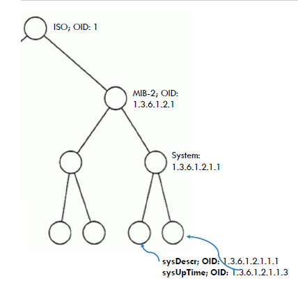
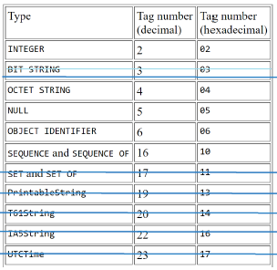
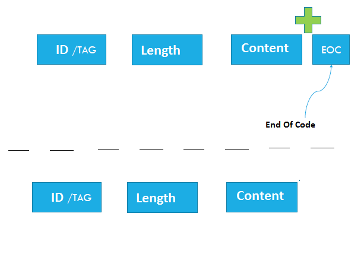
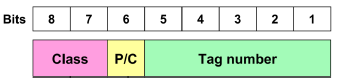
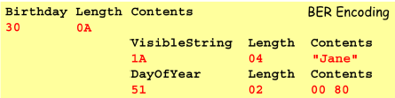
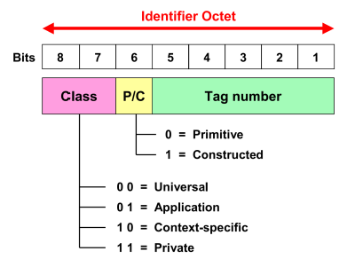

# SNMP
C++, Object Oriented Programming, REGEX, coder BER

Project's etaps:

DONE:

1.Parsing RFC1213-MIB.txt by REGEX. Parser syntax SMI, part of ASN.1

2.Creating mib-tree and capture new types defined in the file RFC1213-MIB.txt and derivatives.

3.Coder BER(Basic Encoding Rules) on base of CCITT X.209 document.

TO DO:

4.Dekoder BER

5.Network functionality

Final functionality:

Program should read MIB file, use BER coder to send date by internet and recive correctly on SNMP GET, 

SNMP SET, oraz SNMP GETNEXT requests.

